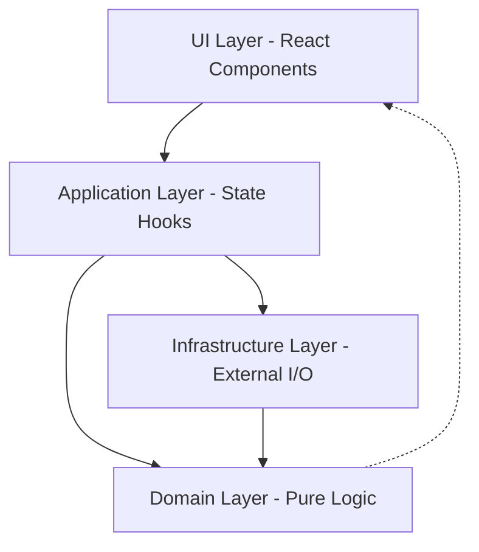

Netcatty follows a clean, layered architecture separating domain logic, application state, infrastructure, and UI.

## Architecture Layers

The codebase is organized into four primary layers:



### Layer Responsibilities

| Layer | Location | Purpose | Dependencies |
|-------|----------|---------|-------------|
| **Domain** | `domain/` | Pure business logic, models, helpers | None (pure functions) |
| **Application** | `application/state/` | State management, orchestration | Domain, Infrastructure |
| **Infrastructure** | `infrastructure/` | External I/O, persistence, services | Domain |
| **UI** | `components/`, `App.tsx` | Presentation, user interaction | Application, Domain |

From `agents.md:6-19`:

<Info>
**Dependency Rule:** Dependencies flow inward. Domain has no external dependencies. Application depends on Domain and Infrastructure. UI depends on Application and Domain.
</Info>

## Domain Layer

Location: `domain/`

### Purpose

Pure business logic and domain models. No side effects, no external dependencies.

### Key Files

**`domain/models.ts`** (714 lines)

Core domain models:
- `Host` - SSH/Telnet/Serial connection configuration
- `SSHKey` - SSH key management
- `Identity` - Reusable authentication credentials
- `Snippet` - Command snippets and scripts
- `Workspace` - Terminal split/pane layout
- `TerminalSession` - Active terminal state
- `SftpConnection` - SFTP session state
- `PortForwardingRule` - SSH tunnel configuration
- `KnownHost` - SSH host key verification
- `ConnectionLog` - Connection history and replay

**`domain/host.ts`**

Host-specific helpers:
- Distro detection and normalization
- Host sanitization and validation

**`domain/workspace.ts`**

Workspace tree operations:
- Split pane management (horizontal/vertical)
- Pane insertion and removal
- Size calculations
- Tree traversal

**Other domain modules:**
- `credentials.ts` - Credential validation
- `quickConnect.ts` - SSH URI parsing
- `sshAuth.ts` - Auth method selection
- `sshConfigSerializer.ts` - SSH config export
- `sync.ts` - Data sync operations
- `vaultImport.ts` - Import from other SSH clients

## Application Layer

Location: `application/state/`

### Purpose

React hooks that manage state and orchestrate domain logic with infrastructure services.

### State Management Pattern

Each hook owns its state and persistence:

```typescript
// Example pattern from application/state hooks
const [state, setState] = useState(initialState);

// Load from persistence on mount
useEffect(() => {
  const loaded = localStorageAdapter.get(STORAGE_KEY);
  if (loaded) setState(loaded);
}, []);

// Persist on change
useEffect(() => {
  localStorageAdapter.set(STORAGE_KEY, state);
}, [state]);
```

### Key Hooks

**`useVaultState`**

Manages hosts, keys, snippets, groups:
- CRUD operations for hosts/keys/snippets
- Custom groups and tagging
- Import/export vault data
- Persistence to localStorage

**`useSessionState`**

Manages terminal sessions and workspaces:
- Session lifecycle (create/destroy)
- Workspace split/focus management
- Drag-and-drop session management
- Session restoration

**`useSettingsState`**

Manages application settings:
- Theme (UI and terminal)
- Accent color and mode
- Font family and size
- Terminal preferences
- Keyboard shortcuts
- Sync configuration

**SFTP State Hooks** (`application/state/sftp/`)

- `useSftpConnections` - Connection pool management
- `useSftpDirectoryListing` - Directory browsing
- `useSftpTransfers` - Upload/download operations
- `useSftpFileWatch` - Auto-sync file changes
- `useSftpExternalOperations` - External editor integration

**Backend Integration Hooks**

- `useApplicationBackend` - IPC bridge to Electron main process
- `useClipboardBackend` - System clipboard integration
- `useKeychainBackend` - System keychain integration
- `useKnownHostsBackend` - SSH host key management
- `useCloudSync` - GitHub Gist/S3/OneDrive sync

## Infrastructure Layer

Location: `infrastructure/`

### Purpose

External integrations, I/O, configuration, and persistence.

### Structure

```
infrastructure/
├── config/
│   ├── defaultData.ts           # Seed data
│   ├── fonts.ts                 # Terminal font configurations
│   ├── storageKeys.ts           # localStorage key constants
│   ├── terminalThemes.ts        # Built-in terminal color schemes
│   ├── uiFonts.ts               # UI font configurations
│   └── uiThemes.ts              # UI color schemes
├── parsers/
│   └── (SSH config parsers, etc.)
├── persistence/
│   └── localStorageAdapter.ts   # localStorage abstraction
└── services/
    └── (External service integrations)
```

### Configuration Files

**`infrastructure/config/storageKeys.ts`**

Centralized storage key definitions (70 keys):

```typescript
export const STORAGE_KEY_HOSTS = 'netcatty_hosts_v1';
export const STORAGE_KEY_KEYS = 'netcatty_keys_v1';
export const STORAGE_KEY_SNIPPETS = 'netcatty_snippets_v1';
export const STORAGE_KEY_THEME = 'netcatty_theme_v1';
// ... 66 more keys
```

From `agents.md:31-33`:

<Warning>
**Important:** All localStorage operations MUST use keys from `storageKeys.ts`. Avoid ad-hoc localStorage calls elsewhere.
</Warning>

**`infrastructure/config/terminalThemes.ts`**

Built-in xterm.js color schemes (39,558 lines total):
- Dracula, Monokai, Solarized Dark/Light
- One Dark, Nord, Gruvbox
- 50+ community themes

## UI Layer

Location: `components/`, `App.tsx`

### Purpose

Presentation logic and user interaction. Components are "dumb" - they receive data and callbacks from hooks.

### Main Application

**`App.tsx`** (52,396 bytes)

Main application component:
- Wires together all state hooks
- Manages top-level routing (Vault/Terminal/Settings)
- Handles global keyboard shortcuts
- Manages modals and dialogs

### Component Organization

```
components/
├── Terminal.tsx              # Terminal emulator (xterm.js)
├── TerminalLayer.tsx         # Terminal session management
├── SftpView.tsx              # SFTP browser
├── VaultView.tsx             # Host management (grid/list/tree)
├── KeyManager.tsx            # SSH key management
├── KeychainManager.tsx       # Identity/credential management
├── SnippetsManager.tsx       # Command snippet library
├── PortForwardingNew.tsx     # Port forwarding UI
├── SettingsPage.tsx          # Application settings
├── ConnectionLogsManager.tsx # Connection history
├── KnownHostsManager.tsx     # SSH host key management
└── ui/                       # Reusable UI components
    └── aside-panel.tsx       # Shared aside panel system
```

### Component Guidelines

From `agents.md:38-39`:

<Info>
**Keep components dumb:** If a prop list grows large, derive a smaller view model in the hook. Avoid business logic in components.
</Info>

## Electron Main Process

Location: `electron/`

### Main Entry Point

**`electron/main.cjs`**

Electron main process:
- Window creation and management
- IPC bridge initialization
- Protocol registration (`app://`)
- GPU acceleration settings

From `electron/main.cjs:1-14`:

```javascript
/**
 * Netcatty Electron Main Process
 * 
 * All major functionality has been extracted into separate bridge modules:
 * - sshBridge.cjs: SSH connections and session management
 * - sftpBridge.cjs: SFTP file operations
 * - localFsBridge.cjs: Local filesystem operations
 * - transferBridge.cjs: File transfers with progress
 * - portForwardingBridge.cjs: SSH port forwarding tunnels
 * - terminalBridge.cjs: Local shell, telnet, and mosh sessions
 * - windowManager.cjs: Electron window management
 */
```

### Bridge Architecture

Location: `electron/bridges/`

Bridges provide IPC communication between renderer (React) and main process:

| Bridge | Purpose | Key Features |
|--------|---------|-------------|
| **sshBridge.cjs** | SSH connections | Connection pool, keepalive, host key verification |
| **sftpBridge.cjs** | SFTP operations | Directory listing, file operations, permissions |
| **terminalBridge.cjs** | PTY sessions | Local shell, Telnet, Mosh, Serial |
| **transferBridge.cjs** | File transfers | Upload/download with progress, resume |
| **portForwardingBridge.cjs** | SSH tunnels | Local/remote/dynamic port forwarding |
| **localFsBridge.cjs** | Local filesystem | Browse local files for SFTP |
| **windowManager.cjs** | Window management | Multi-window support, window state |
| **credentialBridge.cjs** | System keychain | macOS Keychain, Windows Credential Manager |
| **tempDirBridge.cjs** | Temp file management | SFTP external editor temp files |
| **sessionLogsBridge.cjs** | Session logging | Auto-save terminal output |
| **cloudSyncBridge.cjs** | Cloud sync | GitHub Gist, S3, OneDrive |

### Helper Modules

**`electron/bridges/sshAuthHelper.cjs`**

Shared SSH authentication logic:
- Default key discovery (`~/.ssh/id_*`)
- Encrypted key detection
- SSH agent integration
- Multi-key fallback

From `electron/bridges/sshAuthHelper.cjs:12-13`:
```javascript
const DEFAULT_KEY_NAMES = ["id_ed25519", "id_ecdsa", "id_rsa"];
```

**`electron/bridges/keyboardInteractiveHandler.cjs`**

Handles keyboard-interactive SSH authentication prompts.

**`electron/bridges/passphraseHandler.cjs`**

Manages encrypted SSH key passphrase prompts.

**`electron/bridges/proxyUtils.cjs`**

HTTP and SOCKS5 proxy support for SSH connections.

## Data Flow

### Example: Opening an SSH Connection

1. **UI:** User clicks host in `VaultView.tsx`
2. **Application:** `useSessionState` hook creates session
3. **Application:** Hook calls `window.electronAPI.ssh.connect(config)`
4. **Bridge:** `sshBridge.cjs` receives IPC call
5. **Bridge:** Uses `sshAuthHelper.cjs` to build auth config
6. **Bridge:** Establishes SSH connection via `ssh2` library
7. **Bridge:** Emits connection status events back to renderer
8. **Application:** Hook updates session state
9. **UI:** `Terminal.tsx` receives session and renders xterm.js

### Example: SFTP File Upload

1. **UI:** User drags file into `SftpView.tsx`
2. **Application:** `useSftpTransfers` hook creates transfer task
3. **Application:** Hook calls `window.electronAPI.transfer.upload(task)`
4. **Bridge:** `transferBridge.cjs` receives IPC call
5. **Bridge:** Reads local file via `localFsBridge.cjs`
6. **Bridge:** Uploads via `sftpBridge.cjs` with progress events
7. **Application:** Hook receives progress updates, updates UI
8. **Bridge:** Emits completion event
9. **Application:** Hook marks transfer complete
10. **UI:** SFTP directory refreshes to show new file

## Temporary File Management

From `agents.md:34`:

<Warning>
**Temporary files:** All temp files (e.g., SFTP external editing) MUST be written to Netcatty's dedicated temp directory via `tempDirBridge.getTempFilePath(fileName)`. Do NOT write directly to `os.tmpdir()`.
</Warning>

This ensures:
- Proper cleanup on app exit
- User visibility in Settings > System
- Isolation from other applications

## Coding Conventions

From `agents.md:41-45`:

<AccordionGroup>
  <Accordion title="Layer Separation">
    - Keep logic pure in domain (no side effects)
    - Side effects belong to application/infrastructure layers
    - UI components should not call infrastructure directly
  </Accordion>

  <Accordion title="State Management">
    - Prefer composition over deep prop drilling
    - Lift shared state into hooks
    - Use Context sparingly (hooks are preferred)
  </Accordion>

  <Accordion title="External I/O">
    - Avoid direct network/fetch in components
    - Add a service/adapter in infrastructure first
    - Use IPC bridges for Electron main process communication
  </Accordion>

  <Accordion title="Code Style">
    - TypeScript for type safety
    - Maintain ASCII-only unless required by file content
    - Follow existing patterns in the codebase
  </Accordion>
</AccordionGroup>

## Design Patterns

### Aside Panel System

From `agents.md:49-175`:

VaultView subpages share a unified aside panel design system via `components/ui/aside-panel.tsx`:

```tsx
import { AsidePanel, AsidePanelContent, AsidePanelFooter } from "./ui/aside-panel";

<AsidePanel 
  open={isOpen} 
  onClose={handleClose}
  title="Panel Title"
  subtitle="Optional subtitle"
  showBackButton={hasParent}
  onBack={handleBack}
>
  <AsidePanelContent>
    {/* Scrollable content */}
  </AsidePanelContent>
  <AsidePanelFooter>
    <Button>Save</Button>
  </AsidePanelFooter>
</AsidePanel>
```

**Design specs:**
- Position: `absolute right-0 top-0 bottom-0` (parent must be `relative`)
- Width: `w-[380px]` (configurable)
- Background: `bg-background` (solid)
- Border: `border-l border-border/60`
- Content: Auto-scrolling with `space-y-4` gap

## Project Statistics

- **TypeScript files:** 256 files
- **Main app bundle:** `App.tsx` (52KB)
- **Domain models:** `domain/models.ts` (714 lines, 27KB)
- **Terminal themes:** `infrastructure/config/terminalThemes.ts` (39KB)
- **Electron bridges:** 24 bridge modules in `electron/bridges/`

## Tech Stack

From `README.md:280-293`:

| Category | Technology |
|----------|------------|
| Framework | **Electron 40** |
| Frontend | **React 19**, TypeScript |
| Build Tool | **Vite 7** |
| Terminal | **xterm.js 5** |
| Styling | **Tailwind CSS 4** |
| SSH/SFTP | ssh2, ssh2-sftp-client |
| PTY | node-pty |
| Icons | Lucide React |
| Serial | serialport |
| Editor | Monaco Editor (VS Code) |

## Further Reading

<CardGroup cols={2}>
  <Card title="Building" icon="hammer" href="/development/building">
    Build instructions and development setup
  </Card>
  <Card title="Contributing" icon="code-pull-request" href="/development/contributing">
    Contribution guidelines and code style
  </Card>
</CardGroup>