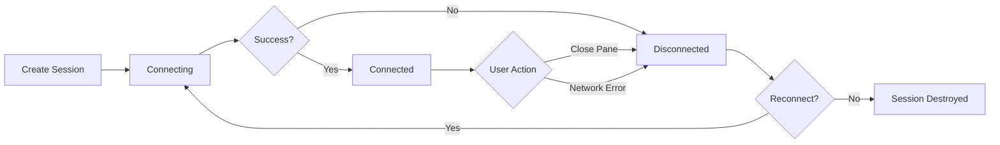

## Overview

Workspaces in Netcatty allow you to organize multiple terminal sessions in split-pane layouts. You can create complex arrangements, save them for later, and restore entire session states with a single click.

## Understanding Workspaces

A workspace is a container for one or more terminal sessions arranged in a flexible layout.

### Workspace Structure

<ResponseField name="Workspace" type="object">
  <Expandable title="Properties">
    <ResponseField name="id" type="string" required>
      Unique workspace identifier (format: `ws-{uuid}`)
    </ResponseField>
    
    <ResponseField name="title" type="string" required>
      Workspace name displayed in the tab
    </ResponseField>
    
    <ResponseField name="root" type="WorkspaceNode" required>
      Root node of the layout tree (pane or split)
    </ResponseField>
    
    <ResponseField name="viewMode" type="WorkspaceViewMode">
      Layout mode: `split` (tiled) or `focus` (list + single terminal)
    </ResponseField>
    
    <ResponseField name="focusedSessionId" type="string">
      Currently focused session ID (used in focus mode)
    </ResponseField>
    
    <ResponseField name="snippetId" type="string">
      Reference to snippet if workspace was created from snippet runner
    </ResponseField>
  </Expandable>
</ResponseField>

### Workspace Nodes

Workspaces are built from two types of nodes:

<Tabs>
  <Tab title="Pane Node">
    A leaf node containing a single terminal session.
    
    ```typescript
    {
      id: "pane-abc123",
      type: "pane",
      sessionId: "session-xyz789"
    }
    ```
  </Tab>
  
  <Tab title="Split Node">
    A container node that arranges child nodes in a direction.
    
    ```typescript
    {
      id: "split-def456",
      type: "split",
      direction: "vertical", // or "horizontal"
      children: [
        { type: "pane", sessionId: "session-1" },
        { type: "pane", sessionId: "session-2" }
      ],
      sizes: [0.5, 0.5] // Relative sizes (sum to 1.0)
    }
    ```
  </Tab>
</Tabs>

## Creating Workspaces

### From Existing Sessions

Combine two or more terminal tabs into a workspace.

**UI Workflow:**

1. Open multiple terminal sessions as separate tabs
2. Right-click on a tab
3. Select **Create Workspace from Tabs**
4. Choose which tabs to include
5. Select initial layout (horizontal or vertical)
6. Click **Create**

Netcatty merges the selected tabs into a single workspace tab with split panes.

### From Snippet Runner

Run a snippet across multiple hosts simultaneously.

**UI Workflow:**

1. Navigate to **Snippets**
2. Select a snippet
3. Click **Run on Multiple Hosts**
4. Select target hosts
5. Click **Run**

Netcatty creates a workspace with:
- One pane per host
- Side-by-side layout
- Snippet execution in each pane

**Example:**

```typescript
const workspace = createWorkspaceFromSessionIds(
  ['session-web01', 'session-web02', 'session-db01'],
  {
    title: 'Deploy to Production',
    viewMode: 'split',
    snippetId: 'deploy-script'
  }
);

// Result:
// ┌─────────┬─────────┬─────────┐
// │ web-01  │ web-02  │  db-01  │
// │         │         │         │
// └─────────┴─────────┴─────────┘
```

## View Modes

### Split View (Default)

Tiled layout with all sessions visible simultaneously.

<ParamField path="viewMode" type="split">
  Display all panes in a split layout
</ParamField>

**Best for:**
- Monitoring multiple servers
- Running parallel commands
- Comparing output across hosts

### Focus View

List of sessions on the left, single focused terminal on the right.

<ParamField path="viewMode" type="focus">
  List view with one terminal in focus
</ParamField>

**Best for:**
- Many sessions (5+)
- Switching between servers frequently
- Limited screen space

**Switching Modes:**

Click the view mode toggle in the workspace toolbar:
- Grid icon = Split view
- List icon = Focus view

## Layout Management

### Splitting Panes

Divide a pane into two sections.

**Horizontal Split (top/bottom):**
- Right-click in terminal → **Split Horizontal**
- Keyboard: `Cmd+D` (Mac) / `Ctrl+Shift+D` (Windows/Linux)

**Vertical Split (left/right):**
- Right-click in terminal → **Split Vertical**  
- Keyboard: `Cmd+Shift+D` (Mac) / `Ctrl+Shift+E` (Windows/Linux)

**Example:**

```
Initial:          After Vertical Split:    After Horizontal Split:
┌─────────┐      ┌────────┬────────┐      ┌────────┬────────┐
│         │      │        │        │      │        │   ┌────┤
│  Pane   │  →   │ Pane 1 │ Pane 2 │  →   │ Pane 1 │   │ P3 │
│         │      │        │        │      │        │   └────┤
└─────────┘      └────────┴────────┘      └────────┴────────┘
```

### Resizing Panes

**Mouse:**
- Hover over the divider between panes
- Cursor changes to resize icon
- Click and drag to adjust size

**Sizes are automatically saved** as relative proportions in the workspace.

### Closing Panes

Close individual panes without destroying the workspace.

**Methods:**
- Click × on pane's tab
- Keyboard: `Cmd+W` (Mac) / `Ctrl+W` (Windows/Linux)
- Right-click → **Close Pane**

**Behavior:**
- When closing a pane from a split, the sibling pane expands to fill the space
- When closing the last pane, the workspace tab closes

## Navigating Workspaces

### Focus Management

Move keyboard focus between panes.

<ParamField path="focusedSessionId" type="string">
  ID of the currently focused session
</ParamField>

**Keyboard Navigation:**

| Action | Mac | Windows/Linux |
|--------|-----|---------------|
| Move focus up | `Cmd+Opt+↑` | `Ctrl+Alt+↑` |
| Move focus down | `Cmd+Opt+↓` | `Ctrl+Alt+↓` |
| Move focus left | `Cmd+Opt+←` | `Ctrl+Alt+←` |
| Move focus right | `Cmd+Opt+→` | `Ctrl+Alt+→` |

**Focus Algorithm:**

Netcatty uses spatial navigation:
1. Determines pane positions based on layout tree
2. Finds panes in the requested direction
3. Selects the closest pane by center point
4. **Wraparound:** If no pane exists in direction, wraps to opposite edge

**Example:**

```
┌─────┬─────┐
│  1  │  2  │
├─────┼─────┤
│  3  │  4  │
└─────┴─────┘

From Pane 1:
- Right → Pane 2
- Down → Pane 3
- Left → Wraps to Pane 2
- Up → Wraps to Pane 3
```

### Mouse Navigation

Click anywhere in a pane to focus it.

## Saving Workspaces

Workspaces are automatically saved when you:
- Create a split
- Resize panes
- Close a pane
- Change view mode

**Persistence:**
- Workspace layout is stored in Netcatty's database
- Session states are **not** stored (terminal content is ephemeral)
- Connection details are preserved via host references

## Restoring Workspaces

Reopen a saved workspace to recreate the layout and reconnect to hosts.

### From Recent Workspaces

1. Click **Workspaces** in the sidebar
2. View list of saved workspaces
3. Click on a workspace to restore

Netcatty will:
- Recreate the split layout
- Reconnect to each host
- Restore pane sizes
- Apply the saved view mode

### From Snippets

If a workspace was created from a snippet:

1. Navigate to **Snippets**
2. Click on the snippet
3. Select **Restore Workspace**
4. Netcatty reloads the workspace and re-runs the snippet

<Warning>
  Terminal content (command history, output) is **not** preserved. Only the layout and connection details are restored.
</Warning>

## Session State

### Terminal Sessions

<ResponseField name="TerminalSession" type="object">
  <Expandable title="Properties">
    <ResponseField name="id" type="string" required>
      Unique session identifier
    </ResponseField>
    
    <ResponseField name="hostId" type="string" required>
      Reference to host configuration
    </ResponseField>
    
    <ResponseField name="hostLabel" type="string" required>
      Display name
    </ResponseField>
    
    <ResponseField name="username" type="string" required>
      SSH username
    </ResponseField>
    
    <ResponseField name="hostname" type="string" required>
      Target hostname/IP
    </ResponseField>
    
    <ResponseField name="status" type="string" required>
      Connection status: `connecting`, `connected`, or `disconnected`
    </ResponseField>
    
    <ResponseField name="workspaceId" type="string">
      ID of parent workspace (if in a workspace)
    </ResponseField>
    
    <ResponseField name="startupCommand" type="string">
      Command to run after connection
    </ResponseField>
    
    <ResponseField name="protocol" type="HostProtocol">
      Protocol override for this session
    </ResponseField>
    
    <ResponseField name="port" type="number">
      Port override for this session
    </ResponseField>
  </Expandable>
</ResponseField>

### Session Lifecycle



## Advanced Workspace Features

### Broadcast Mode

Send input to all panes in a workspace simultaneously.

**Activation:**
- Click **Broadcast** icon in workspace toolbar
- Keyboard: `Cmd+B` (Mac) / `Ctrl+B` (Windows/Linux)

**Use Cases:**
- Run same command across multiple servers
- Parallel software updates
- Synchronized configuration changes

<Warning>
  Broadcast mode affects **all panes** in the workspace. Use carefully in production.
</Warning>

### Nested Layouts

Create complex layouts by nesting splits.

**Example:**

```typescript
{
  type: "split",
  direction: "horizontal",
  children: [
    {
      type: "split",
      direction: "vertical",
      children: [
        { type: "pane", sessionId: "web-01" },
        { type: "pane", sessionId: "web-02" }
      ],
      sizes: [0.5, 0.5]
    },
    { type: "pane", sessionId: "db-01" }
  ],
  sizes: [0.66, 0.34]
}
```

Visual Result:
```
┌────────────┬─────┐
│   web-01   │     │
├────────────┤ db  │
│   web-02   │     │
└────────────┴─────┘
```

### Dynamic Pane Addition

Add new panes to an existing workspace.

**Methods:**
1. Split an existing pane (creates sibling)
2. Drag a tab into the workspace
3. Right-click workspace → **Add Pane** → Select host

## Workspace Examples

### Example 1: Three-Server Monitoring

```json
{
  "id": "ws-monitoring",
  "title": "Production Monitoring",
  "viewMode": "split",
  "root": {
    "type": "split",
    "direction": "vertical",
    "children": [
      { "type": "pane", "sessionId": "web-01" },
      { "type": "pane", "sessionId": "web-02" },
      { "type": "pane", "sessionId": "db-01" }
    ],
    "sizes": [0.33, 0.33, 0.34]
  }
}
```

### Example 2: Development Workspace

```json
{
  "id": "ws-dev",
  "title": "Development Environment",
  "viewMode": "split",
  "root": {
    "type": "split",
    "direction": "horizontal",
    "children": [
      {
        "type": "split",
        "direction": "vertical",
        "children": [
          { "type": "pane", "sessionId": "dev-server" },
          { "type": "pane", "sessionId": "logs" }
        ],
        "sizes": [0.6, 0.4]
      },
      { "type": "pane", "sessionId": "database" }
    ],
    "sizes": [0.7, 0.3]
  }
}
```

## Best Practices

<AccordionGroup>
  <Accordion title="Workspace Organization">
    - Group related servers (e.g., all web servers, all databases)
    - Use descriptive workspace names
    - Create workspace templates for common scenarios
  </Accordion>
  
  <Accordion title="Layout Design">
    - Keep layouts simple (2-4 panes for most tasks)
    - Use horizontal splits for wide terminals (code/logs)
    - Use vertical splits for narrow terminals (monitoring)
  </Accordion>
  
  <Accordion title="Performance">
    - Limit active workspaces to 1-2 at a time
    - Close disconnected sessions
    - Use focus view for 5+ panes
  </Accordion>
  
  <Accordion title="Broadcast Mode">
    - Test commands on a single pane first
    - Use with read-only operations when possible
    - Disable broadcast after use to prevent accidents
  </Accordion>
</AccordionGroup>

## Troubleshooting

<AccordionGroup>
  <Accordion title="Workspace Not Saving">
    **Solution:**
    - Check Netcatty's data directory permissions
    - Verify disk space is available
    - Restart Netcatty to flush database
  </Accordion>
  
  <Accordion title="Session Won't Reconnect on Restore">
    **Possible Causes:**
    - Host configuration was deleted
    - Authentication credentials changed
    - Network connectivity issues
    
    **Solution:**
    - Verify host still exists in Hosts page
    - Check authentication settings
    - Try connecting to host directly first
  </Accordion>
  
  <Accordion title="Pane Sizes Not Preserved">
    **Solution:**
    - Ensure you wait for auto-save after resizing
    - Manually close and reopen workspace to test
    - Check browser console for errors
  </Accordion>
</AccordionGroup>

## Related Resources

<CardGroup cols={2}>
  <Card title="Split Terminals" icon="grip-lines" href="/guides/split-terminals">
    Keyboard shortcuts and pane management
  </Card>
  
  <Card title="Snippets" icon="code" href="/guides/snippets">
    Run commands across multiple hosts
  </Card>
  
  <Card title="Keyboard Shortcuts" icon="keyboard" href="/guides/keyboard-shortcuts">
    Master workspace navigation shortcuts
  </Card>
</CardGroup>